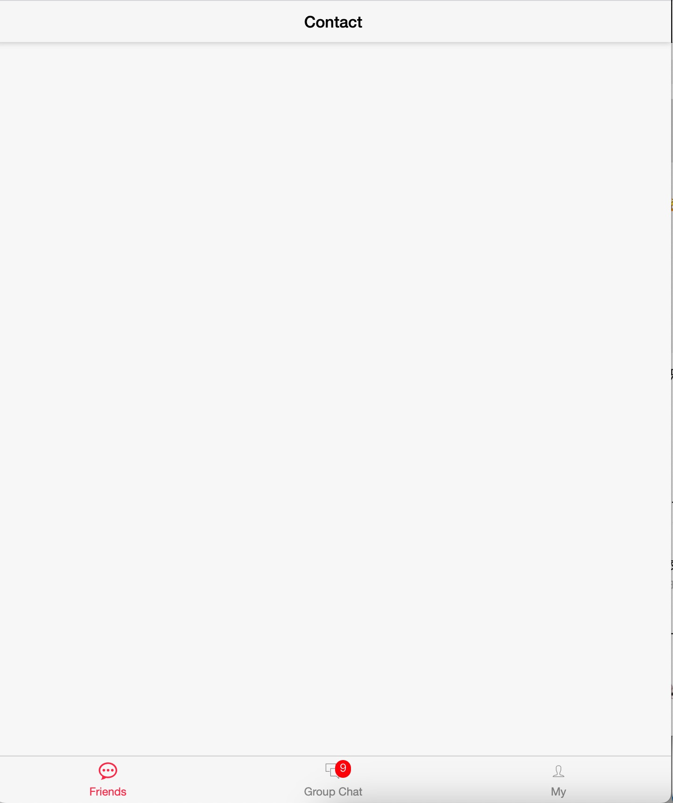
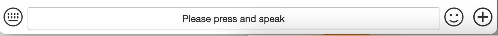

# GoChat

A Chating System built with Golang

Instant messaging system (chat, groups, friends, vote, all activities!) written with Go Programming Language

Go, Gin, WebSocket, MySQL, Redis, Vue.js


## Features
Chating: 
Group chat: Communicate with multiple people in a single chat room.

Image/Video/Audio sending: Share multimedia files with other users.

Address-sharing: Share your location with other users in real-time.

Real-time chat: Messages are delivered instantly using WebSocket.


## Technologies Used
Golang: programming language used to develop the backend of the application.

Gin: web framework for Golang used to build the RESTful API of the application.

WebSocket: Protocol used to enable real-time communication between the client and server.

Redis, MySQL: Database used to store user information and messages.

Vue.js: A JavaScript framework used to develop the frontend of the application.

## Installation
Clone the repository Copy code
```bash
  git clone https://github.com/MingyuanRen/GoChat.git
```

Install the required dependencies
```bash
  cd GoChat
  go mod download
```

Set up the MySQL database by executing the SQL script found in db/mysql.sql

Configure the application by creating a .env file based on the .env.example file.

Start the application
```bash
  go run main.go
```
## Demo








